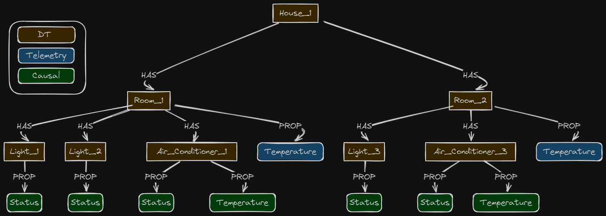
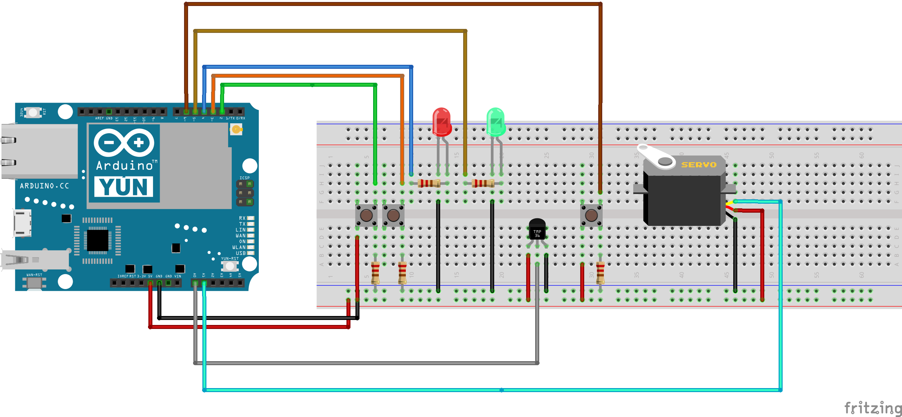

# House Scenario
## Modeling a House Scenario for Digital Twins.
This scenario uses the DTDL Extended version to model a Digital Twin Scenario. We also made available the source code for the Arduino/ESP32 in order to simulate a House Scenario. The house is composed of rooms, where each room can have lightbulbs or air-conditioner devices. A lightbulb can be turned on/off, whereas an air-conditioner can turned on/off, and its temperature can be set. Each room also has a temperature sensor. Figure 1 represents the room concept.

## Physical Devices
To demonstrate our proposal, we assemble two different circuits using ESP32 and Arduino Yún Boards, including temperature sensors, LEDs, pushbuttons, and servo motors, which in this case represent the air-conditioner and the temperature setting is responsible for defining the angle of rotation for the servo motor. The idea is to emulate an actual room and validate the causal connections established. Figure 2 is an approximate schematic for Room 1. Room 2's schematics are the same but with just one LED. The source code is available under the folder Arduino.

## Modeling Using DTDL

In order to create DT instances used by our middleware, the first step is to create models to represent digital twins, their attributes, and their relationships. So, in order to create the scenario presented in Figure 1, we designed the following models:
- [House](models/House.json): Represents a house composed of rooms. It also has properties called Name and Address.
- [Room](models/Room.json): Represents a house room. It has one property called size and a telemetry named temperature. This telemetry indicates that the data associated with it is obtained from a sensor. It also has two relations ships called lights and air-conditioner, indicating that a Room can have LightBulbs and AirConditioner.
- [LightBulb](models/LightBulb.json): Represents a Lightbulb with a single property called status, which is also causal. The causal extension indicates that this property must be synchronized bi-directionally.
- [AirConditioner](models/AirConditioner.json): This represents an air-conditioner with two properties called temperature and status, where both have causal connections.